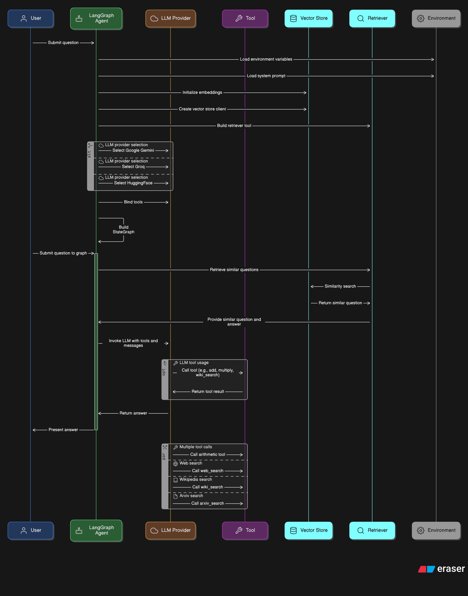

# 🧠 LangGraph Agent – GAIA Benchmark Project

This project was built as part of the [Hugging Face AI Agents Course](https://huggingface.co/learn/agents-course/).

It showcases a retrieval-augmented agent powered by **LangGraph**, integrates multiple **LLMs (Gemini, Groq, HuggingFace)**, and uses **Supabase** for vector search. The agent is benchmarked using the **GAIA evaluation framework** — and surpasses the required 30% score threshold for certification.

## 🚀 Live Demo

👉 [Run the Agent on Hugging Face](https://huggingface.co/spaces/Phoenix07/Final_Assignment_Template)

## 🧩 Key Features

- 🔁 **LangGraph Agent Flow** – Built using `StateGraph` for dynamic routing and tool invocation  
- 🔌 **LLM-agnostic Design** – Swap between Gemini, Groq, or HuggingFace models  
- 🧠 **Retriever + RAG Setup** – Context-aware answers based on Supabase vector store  
- 🛠️ **Tool Calling** – Functions with structured input, tool selection & retry logic  
- ✅ **Benchmarked** – Evaluated using the GAIA benchmark with leaderboard submission

## 📂 Folder Structure

```

langgraph-agent-gaia/
├── agent/              # LangGraph nodes and graph definition
├── tools/              # Custom tool functions invoked by the agent
├── retriever/          # Supabase-based vector search logic
├── benchmark/          # GAIA test scripts/configs
├── visuals/            # Architecture diagrams and flow charts
├── certificate.pdf     # Course certificate (from Hugging Face)
└── README.md

```

## 🧠 System Architecture

Below is the high-level design of the agent pipeline:



- The agent receives user input.
- It passes through a retriever that uses Supabase vector store.
- The retrieved documents + input go to the assistant node (LLM).
- Tools are conditionally invoked based on parsed intent.
- The process loops if retry is triggered.

## 📜 Certificate of Completion

Successfully completed the Hugging Face AI Agents Course  
with a final project submission evaluated on GAIA.

See [`certificate.pdf`](./certificate.pdf)

## 🙏 Acknowledgments

Huge thanks to the amazing course creators for designing such a hands-on and practical curriculum:

- **Joffrey Thomas**
- **Ben Burtenshaw**
- **Thomas Simonini**
- **Sergio Paniego Blanco**

Also grateful for the contributions from:
- **Pedro Cuenca**
- **Aymeric Roucher**
- **Joshua Lochner**  
and the entire Hugging Face team for fostering an open learning space.

---

## 🛠️ Future Improvements

This project lays the foundation for a flexible, modular agent pipeline — and there's more I'd like to build on top of it.

### 🔍 Planned Enhancements:
- **Agent Monitoring with LangSmith**  
  Integrate LangSmith to track agent steps, tool calls, LLM responses, and context windows — providing rich observability into the reasoning chain and enabling better debugging and performance tuning.
  
- **Expanded GAIA Benchmark Coverage**  
  Run the agent across more GAIA tasks to stress-test tool use and long-context reasoning.

- **Dynamic Tool Selection via Embedding Search**  
  Instead of hardcoded tools, use embeddings to dynamically select tools based on semantic similarity to user queries.

- **Streamed Output + UI**  
  Add streaming responses and a minimal UI interface for real-time interactions.

---

## 💬 Contact

Built and maintained by [Jyoti Nigam](https://linkedin.com/in/jyotinigam-phoenix)  
If you're exploring AI Agents, RAG, or LangGraph — feel free to connect!

---
